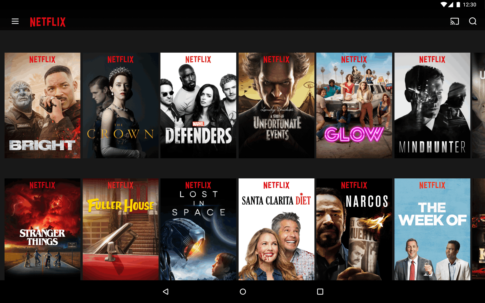
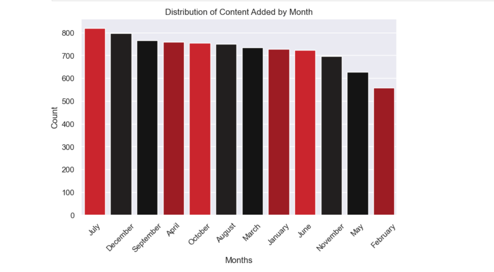
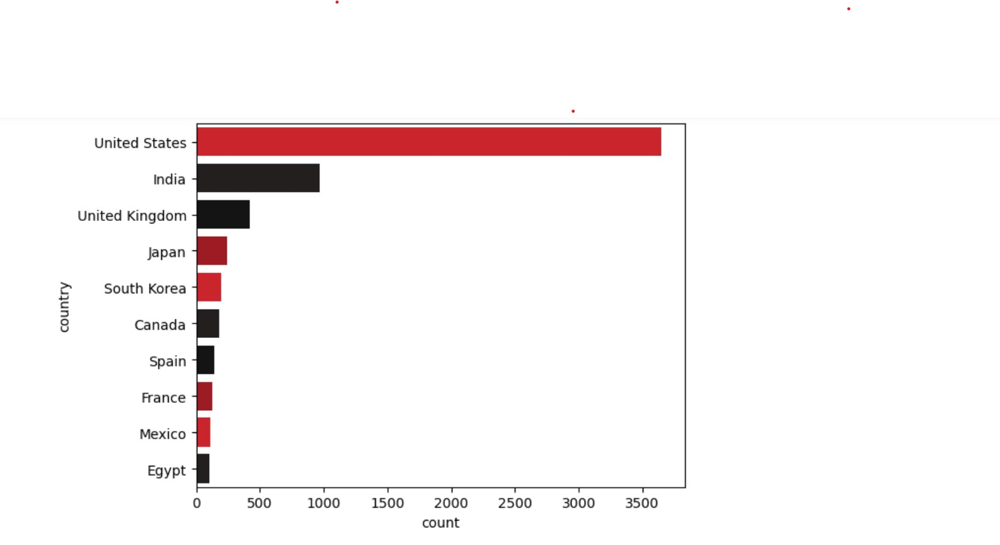

# Netflix-Data-Analysis

## Overview
Explore Netflix's content library through data analysis using Python and libraries such as Pandas, Matplotlib, and Seaborn.

## Dataset
The dataset contains details about Netflix movies and TV shows, including 'title',' show_id', 'type', 'director', 'cast', 'country', 'date_added','release_year', 'rating', 'duration', 'listed_in', 'description'.
## Key Questions

1. **Content Variety**
   - What is the distribution of content types (movies vs. TV shows) on Netflix?

2. **Genre Preferences**
   - Which genres are most popular among Netflix users for TV shows and movies?

3. **Content Producers**
   - Which countries are the major contributors to Netflix's content?

4. **Ideal Release Months**
   - When is the best time to release content on Netflix?

5. **Year-wise Analysis**
   - In which year did Netflix see the highest number of content releases?

6. **Viewer Ratings Analysis**
   - What are the most common viewer ratings for Netflix content?

- For more in-depth analysis and additional questions, please refer to the "Netflix Data Analysis" file.

## Data Analysis

some of insights or key findings for the questions mentioned above. Include relevant graphs and visualizations.
- **When is the best time to release content on Netflix?**
### Ideal Release Months

**Which countries are the major contributors to Netflix's content?**
### Content Producers

## Code Structure
- Data loading and preprocessing
- Data analysis and exploration
- Data visualization using Matplotlib and Seaborn
- Interpretation and presentation of findings

## 📌Insight and Conclusion
- **Diverse Content Mix**: Netflix offers a diverse range of content, with 69.6% movies and 30.4% TV shows.

- **Genre Insights**: International TV Shows are a hit among the top TV shows, while Drama rules the movie category.

- **Top Content Providers**: The United States, India, and the United Kingdom are the primary content producers on Netflix.

- **Best Release Months**: For optimal content releases, focus on July, December, and September – they attract the most viewers.

- **Year-wise Peak**: 2018 marked a peak in Netflix movie releases. It's an ideal reference for planning content.

- **Viewer Ratings**: Netflix's most common rating is 'TV-MA,' indicating a significant collection for mature audiences. There's also content for 'TV-14,' 'TV-PG,'
and  'R' fans.

- **Recommendation**: To maximize engagement, prioritize International TV Shows, Drama movies, and mature content. Strategically release in July, December, or September, and monitor audience trends for consistent success.

  **Thank You**
